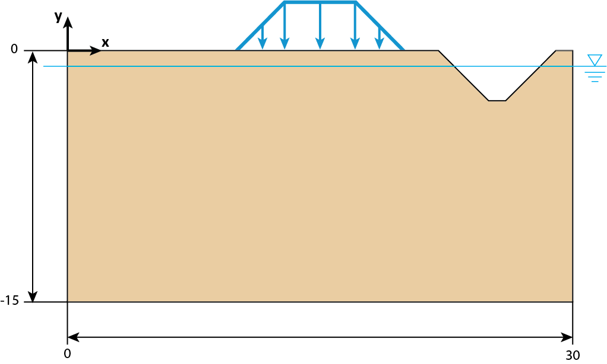
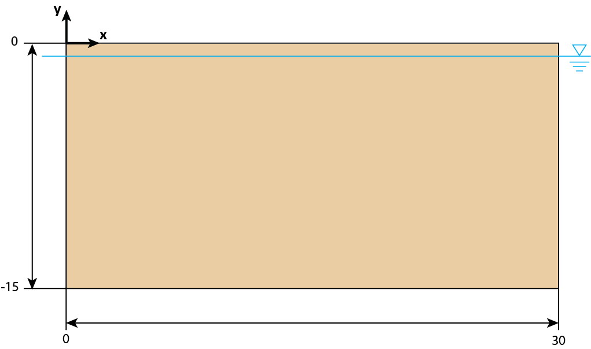
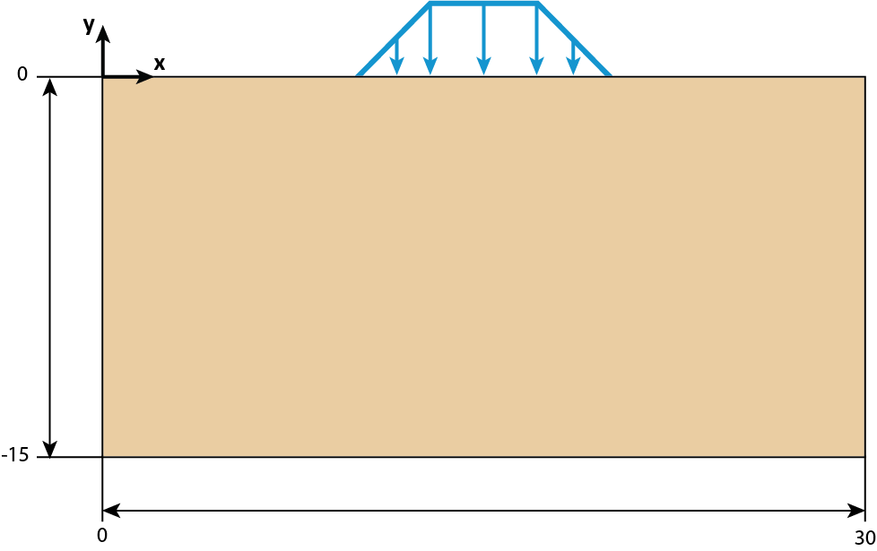
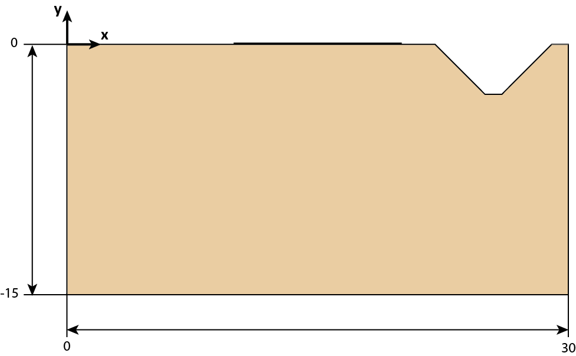
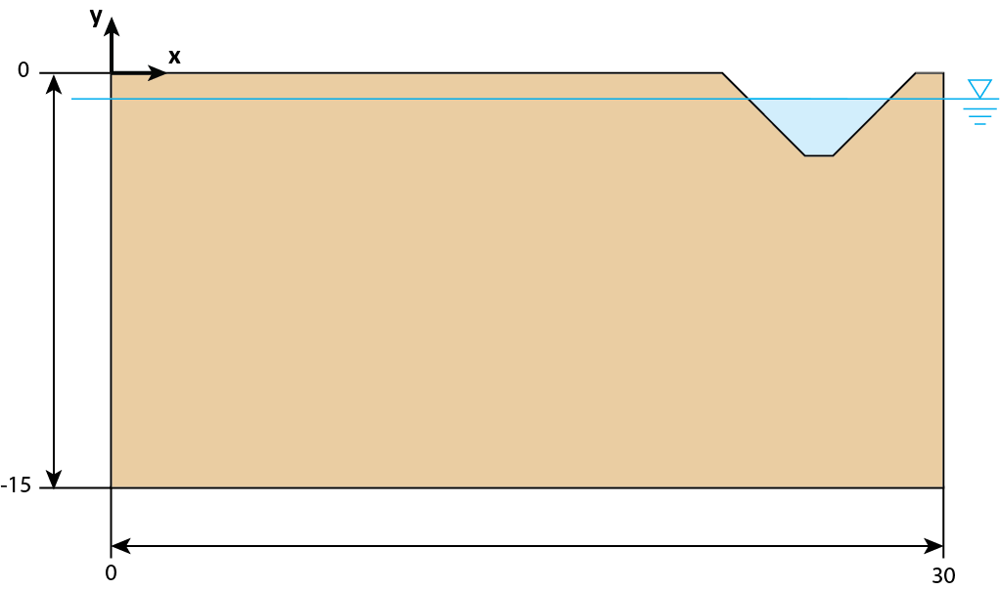

# Examples and Tutorials

A collection of practical example cases and step-by-step tutorials.

**Tutorial Index**

- [Settlement workflow](#settlement-workflow)
- More examples coming soon.

## Settlement workflow

### A Settlement Scenario in Kratos

Deltares  
kratos@deltares.nl

Keywords: Kratos, Settlement, API  
Summary: This document contains a settlemenet scenario in Kratos and API documentation for Settlement.

Author: Marjan Fathian
Reviewer I: Jonathan Nuttall
Reviewer II: Arthur Baart
Version: 1.01
Date: October-November 2023

### Four-stage settlement calculation by Kratos

#### Introduction

This document describes a scenario that includes four stages of calculation that Kratos can perform.

The scenario consists of four stages:

1. Initial stage, where only a soil block is present, including a water headline.
2. First load stage, where a non-uniform load representative of a dike is applied to a part of the soil.
3. Second load stage, where the magnitude of the non-uniform load is increased.
4. Excavation stage, where a part of the soil is removed. The embankment load is still present, and it has not been changed.

Below is an image of the model at the end of the fourth stage:



#### First stage

In the first stage, the geometry is a straightforward rectangle of soil with a water headline. In this stage, the initial stresses in this block of soil will be calculated. The geometry is shown in the following figure.



Note that the x-coordinates of the soil part are in the range [0-30] m and its y-coordinates are in the range [-15-0] m.

##### K0 procedure

In the first stage, the K0 procedure is used to define the initial stresses.
For applying this procedure, the K0 process should be assigned to the body of the soil. The following process is then added to the "Processes" in ProjectParameters_stage1.json file:

```text
"auxiliar_process_list": [{
	"python_module": "apply_k0_procedure_process",
	"kratos_module": "KratosMultiphysics.GeoMechanicsApplication",
	"process_name": "ApplyK0ProcedureProcess",
	"Parameters": {
		"model_part_name": "PorousDomain.K0_model_part",
		"variable_name": "CAUCHY_STRESS_TENSOR"}
}]
```

The associated model part needs to be added to the "processes_sub_model_part_list" in the "solver_settings" part as: "K0_model_part".

Note that this process is removed for the remaining stages.

##### Load

In each of the four stages, the gravitational force load is applied to the soil body (9.81 m/s^2).
In order to apply this process to the soil domain, the "ApplyVectorConstraintTableProcess" is used with a variable name of "VOLUME_ACCELERATION". This load is active in the Y direction, with gravity as its value.

In general, the processes are applied to the sub-model part in the "model_part_name" within the "PorousDomain.".

```text
{
	"python_module": "apply_vector_constraint_table_process",
	"kratos_module": "KratosMultiphysics.GeoMechanicsApplication",
	"process_name": "ApplyVectorConstraintTableProcess",
	"Parameters": {
		"model_part_name": "PorousDomain.Gravitational_load",
		"variable_name": "VOLUME_ACCELERATION",
		"active": [false,true,false],
		"value": [0.0,-9.81,0.0],
		"table": [0,0,0]}
}
```

The associated model part is then added to "processes_sub_model_part_list" in the "solver_settings" part by its name: "Gravitational_load".

##### Water

The blue line in the previous picture represents the water headline, which is located at $y = -1$ m. It remains at this location throughout the scenario.

To define the water level in Kratos, the "ApplyScalarConstraintTableProcess" is used, where the value of "reference_coordinate" indicates the level of the constant water level, and "variable_name" is set to "WATER_PRESSURE". This process is applied to the "Head_line" sub-model part within the "PorousDomain." It sets the water pressure boundary conditions based on hydrostatic conditions, thus the "fluid_pressure_type" is set to "Hydrostatic".

This process is defined in the "constraints_process_list":

```text
{
	"python_module": "apply_scalar_constraint_table_process",
	"kratos_module": "KratosMultiphysics.GeoMechanicsApplication",
	"process_name": "ApplyScalarConstraintTableProcess",
	"Parameters": {
		"model_part_name": "PorousDomain.Head_line",
		"variable_name": "WATER_PRESSURE",
		"is_fixed": false,
		"fluid_pressure_type": "Hydrostatic",
		"gravity_direction": 1,
		"reference_coordinate": -1.0,
		"table": 0,
		"pressure_tension_cut_off": 0.0,
		"specific_weight": 9.81}
}
```

The associated model part is added to "processes_sub_model_part_list" in the "solver_settings" part by its name: "Head_line".

In order to define the bottom pore pressure, assuming a hydrostatic pressure, this "WATER_PRESSURE" is assigned along the bottom edge of the model, using the "ApplyScalarConstraintTableProcess". The "fluid_pressure_type" is defined as "Uniform". The value of the bottom pressure is calculated as below:

$$
p_s = g_w h_w
$$

where:

$p_s$ is the saturated pore water pressure (kPa),  
$g_w$ is the unit weight of water (kN/m^3),  
$g_w$ = 9.81 (kN/m^3),  
$h_w$ is the depth below the water table (m).

This process fixes the water pressure to a uniform value of -137.34 (kPa). The water pressures are fixed along the bottom edge of the soil part:

```text
{
	"python_module": "apply_scalar_constraint_table_process",
	"kratos_module": "KratosMultiphysics.GeoMechanicsApplication",
	"process_name": "ApplyScalarConstraintTableProcess",
	"Parameters": {
		"model_part_name": "PorousDomain.Bottom_pressure",
		"variable_name": "WATER_PRESSURE",
		"is_fixed": true,
		"fluid_pressure_type": "Uniform",
		"value": -137.34,
		"table": 0}
}
```

The associated model part is added to "processes_sub_model_part_list" in the "solver_settings" part by its name: "Bottom_pressure".
These processes remains the same throughout the four stages.

##### Supports

Along the bottom edge of the soil part (at $y = -15$ m), all displacements are restrained (i.e., it has fixed support). Along the vertical sides of the soil part (at $x = 0$ m and $x = 30$ m), a sliding support is applied (i.e., horizontal displacements are restrained, but vertical displacements can freely occur).

For constraining the displacements at the bottom of the soil domain in Kratos, the "ApplyVectorConstraintTableProcess" is used with variable name of "DISPLACEMENT", where all entries of array "is_fixed" are set to true (make sure all the components are active). This will fix the displacement in all three directions (X, Y, and Z). This process is defined in the "constraints_process_list":

```text
{
	"python_module": "apply_vector_constraint_table_process",
	"kratos_module": "KratosMultiphysics.GeoMechanicsApplication",
	"process_name": "ApplyVectorConstraintTableProcess",
	"Parameters": {
		"model_part_name": "PorousDomain.Bottom_fixed",
		"variable_name": "DISPLACEMENT",
		"active": [true,true,true],
		"is_fixed": [true,true,true],
		"value": [0.0,0.0,0.0],
		"table": [0,0,0]}
}
```

The associated model part is added to "processes_sub_model_part_list" in the "solver_settings" part by its name: "Bottom_fixed".

For side boundary conditions, the "ApplyVectorConstraintTableProcess" is used with variable name of "DISPLACEMENT" to limit the movements along the edges of the soil domain in Kratos. For X and Z directions, entries of the array "is_fixed" are set to true (make sure the active directions are set to these values). This will fix the displacement in the X and Z directions while allowing movement in the Y direction.
This process is also defined in the "constraints_process_list":

```text
{
	"python_module": "apply_vector_constraint_table_process",
	"kratos_module": "KratosMultiphysics.GeoMechanicsApplication",
	"process_name": "ApplyVectorConstraintTableProcess",
	"Parameters": {
		"model_part_name": "PorousDomain.Side_sliders",
		"variable_name": "DISPLACEMENT",
		"active": [true,false,true],
		"is_fixed": [true,false,true],
		"value": [0.0,0.0,0.0],
		"table": [0,0,0]}
}
```

The associated model part is added to "processes_sub_model_part_list" in the "solver_settings" part by its name: "Side_sliders".
These displacement boundary conditions are applied to all four stages.

#### Second stage

In the second stage, a non-uniform load of 5 kN/m in the shape of a trapezoid as a representation of the embankment on the top edge of the soil is added.

##### Load

The load consists of:

- Start Point: The load begins at x = 10 m, which means there is no load applied before this point. This initial section represents a uniform load of zero.
- First Ramp: From x = 10 m to x = 12.5 m, the load increases uniformly. This section represents a linear increase in load.
- Constant Load: From x = 12.5 m to x = 17.5 m, the load remains constant with a magnitude of 5  kN/m for the second stage and then increases to 15 kN/m for the third stage.
- Second Ramp: From x = 17.5 m to x = 20 m, the load decreases uniformly to zero. This section represents a linear decrease in load.

See also the next figure.



For applying the load in Kratos, in the second stage where the initial embankment loading takes place, note that the load can be applied to the whole surface on top, but the table defining the load in the mesh (.mdpa) file needs to describe the load amount from the beginning of the surface till the end of the surface. If not well defined, linear extrapolation will take place.
Therefore, it is advisable to avoid introducing slopes at the beginning or end of a table, as this can lead to unexpected behavior. A practical approach is to incorporate 'plateaus,' which are essentially horizontal line segments, at both the start and end of the table. The specific lengths of these 'plateaus' are somewhat flexible, as values will remain constant beyond the table endpoints due to the extrapolation feature. However, it's important not to make these plateaus too small, as even minor deviations from a horizontal line can become pronounced when extending beyond the table's boundaries.

For applying a non-uniform load on top of the soil, the "ApplyVectorConstraintTableProcess" is used, and the load condition is applied from $x = 0$ m and ending at $x = 22$ m (till where excavation begins) or even at the end of the geometry. This non-uniform load is defined in the ProjectParameters_stage2.json file in the "loads_process_list":

```text
{
	"python_module": "apply_vector_constraint_table_process",
	"kratos_module": "KratosMultiphysics.GeoMechanicsApplication",
	"process_name": "ApplyVectorConstraintTableProcess",
	"Parameters": {
		"model_part_name": "PorousDomain.First_line_load",
		"variable_name": "LINE_LOAD",
		"active": [false,true,false],
		"value": [0.0,0.0,0.0],
		"table": [0,1,0]}
}
```

The associated model part for this load needs to be added to the "processes_sub_model_part_list" in the "solver_settings" part as: "First_line_load".

In this process, the value of the load defined here will be overwritten by the amount in the table in the mesh (.mdpa) file. In order to define a table for the load, the table number should be put in the direction of the load.

Note that the table values are not multiplication factors but actual load values.

The table in the mesh (.mdpa) file is added on top of the file as follows:

```text
Begin Table 1 X LINE_LOAD_Y
0.0   0.0
10.0  0.0
12.5 -5.0
17.5 -5.0
20.0  0.0
30.0  0.0
End Table
```

Note that the table number must be put in the load SubModelPart under "Begin SubModelPartTables": in the mesh (.mdpa) file:

```text
Begin SubModelPart First_line_load
Begin SubModelPartTables
1
End SubModelPartTables
Begin SubModelPartNodes
424
436
.
.
.
```

Note that the other processes including the water pressures, displacement boundary conditions and gravitational load are applied in the same way as the previous stage.

#### Third stage

In the third stage, the loading of the embankment is increased; therefore, another load is defined to be able to assign a new table to it. Assigning another table to the same load condition results in unexpected behavior.

##### Load

The process is the same as the previous stage. The load is defined in the ProjectParameters_stage3.json file in the "loads_process_list" as "Second_line_load".

```text
{
	"python_module": "apply_vector_constraint_table_process",
	"kratos_module": "KratosMultiphysics.GeoMechanicsApplication",
	"process_name": "ApplyVectorConstraintTableProcess",
	"Parameters": {
		"model_part_name": "PorousDomain.Second_line_load",
		"variable_name": "LINE_LOAD",
		"active": [false,true,false],
		"value": [0.0,0.0,0.0],
		"table": [0,2,0]}
}
```

Also, this associated model part is added to the "processes_sub_model_part_list" in the "solver_settings" part as: "Second_line_load".

The new table is described under the first table in the mesh (.mdpa) file as table number 2 with the increased value for the non-uniform load:

```text
Begin Table 2 X LINE_LOAD_Y
0.0   0.0
10.0  0.0
12.5 -15.0
17.5 -15.0
20.0  0.0
30.0  0.0
End Table
```

The table number is also put in the load SubModelPart under "Begin SubModelPartTables": in the mesh (.mdpa) file:

```text
Begin SubModelPart Second_line_load
Begin SubModelPartTables
2
End SubModelPartTables
Begin SubModelPartNodes
424
436
.
.
.
```

Note that the other processes including the water pressures, displacement boundary conditions and gravitational load are applied in the same way as the previous stage.

#### Fourth stage

In the final stage, an excavation takes place and some part of the soil is therefore removed, as shown in the following figure:



Note that the excavation starts at $x = 22$ m. The excavation profile consists of three-line segments that connect the following four points: $(22, 0)$, $(25, -3)$, $(26, -3)$, and $(29, 0)$.

##### Excavation

In order to apply the excavation process in Kratos in the fourth stage where this process is carried out, the excavation process is applied to the part of the geometry that will be excavated. This process using "ApplyExcavationProcess" is then added to the list of the "constraints_process_list" in the "Processes" in the ProjectParameters_stage4.json file with "deactivate_soil_part" being set to true:

```text
"python_module": "apply_excavation_process",
"kratos_module": "KratosMultiphysics.GeoMechanicsApplication",
"process_name": "ApplyExcavationProcess",
"Parameters": {
	"model_part_name": "PorousDomain.Excavate_sloot",
	"variable_name": "EXCAVATION",
	"deactivate_soil_part": true
}
```

The associated model part is added to "processes_sub_model_part_list" in the "solver_settings" part by its name: "Excavate_sloot".

##### Water

Some part of the excavation is below the phreatic level as shown in the following figure.



In order to apply the water pressure to the part that has been excavated and is below $y = -1$ m, a normal load is applied to the bottom edge of the excavated area. The normal load "NORMAL_CONTACT_STRESS", uses the "ApplyNormalLoadTableProcess" as its process. The "fluid_pressure_type" is defined as "Hydrostatic" and the "reference_coordinate" is set to $-1$.

```text
{
	"python_module": "apply_normal_load_table_process",
	"kratos_module": "KratosMultiphysics.GeoMechanicsApplication",
	"process_name": "ApplyNormalLoadTableProcess",
	"Parameters": {
		"model_part_name": "PorousDomain.Hydrostatic_load_in_sloot",
		"variable_name": "NORMAL_CONTACT_STRESS",
		"active": [true,false],
		"value": [0.0,0.0],
		"table": [0,0],
		"fluid_pressure_type": "Hydrostatic",
		"gravity_direction": 1,
		"reference_coordinate": -1,
		"specific_weight": 9.81}
}
```

The associated model part is added to "processes_sub_model_part_list" in the "solver_settings" part by its name: "Hydrostatic_load_in_sloot".

Note that the other processes including the water pressures, displacement boundary conditions, gravitational load and the embankment load are applied in the same way as the previous stage.

#### Materials

The soil part consists of a single material: clay. A fully-drained model is assumed. It has a Young's modulus ($E$) of 10,000 kPa and Poisson's ratio ($\nu$) of 0.2. The material's behavior will be described using the linear elastic model, with a solid density ($\rho_{S}$) of 2.65 g/cm^3 and a water density ($\rho_{W}$) of 1.0 g/cm^3. A solid bulk modulus ($K'$) of 35 kN/m^2 and a fluid bulk modulus of 2.0 kN/m^2. The porosity ($n$) of the soil is 0.3.

The material is defined in the MaterialParameters.json file, with the sub-model part in the "model_part_name" within the "PorousDomain.".
The "constitutive_law" being used is "GeoLinearElasticPlaneStrain2DLaw".

The associated model part for this material needs to be added to the "problem_domain_sub_model_part_list" and also to the "body_domain_sub_model_part_list" within "solver_settings" of the ProjectParameters.json files. The following code has been taken from ProjectParameters_stage1.json file:

```text
"problem_domain_sub_model_part_list":
["Clay_after_excavation","Excavated_clay"],

"processes_sub_model_part_list":
["Side_sliders","Bottom_fixed","Head_line","Bottom_pressure"
"Gravitational_load","K0_model_part"],

"body_domain_sub_model_part_list":
["Clay_after_excavation","Excavated_clay"]
```

#### Description of parameters

For a detailed description of the project setting parameters and processes in the ProjectParameters.json file, please head over to: [ProjectParameter.json file description in the Public Wiki of Deltares](https://publicwiki.deltares.nl/x/hgBbDw)

For a detailed description of the material parameters in the MaterialParameters.json file, please head over to: [MaterialParameters.json file description in the Public Wiki of Deltares](https://publicwiki.deltares.nl/x/qQBbDw)

For a breakdown of the mesh (.mdpa) file, please head over to: [Mesh.mdpa file description in the Public Wiki of Deltares](https://publicwiki.deltares.nl/x/owFbDw)

#### Supported schemes and solving strategies

The following solving strategy is supported in the settlement workflow:

- GeoMechanicsNewtonRaphsonStrategy

The following convergence criteria are supported in the settlement workflow:

- DisplacementCriteria

The following linear solvers are supported by Kratos:

- amgcl*
- amgcl_ns*
- bicgstab*
- cg*
- deflated_cg*
- monotonicity_preserving*
- scaling*
- skyline_lu_factorization*
- sparse_cg*
- sparse_lu -> Recommended and tested for this scenario
- sparse_qr*
- tfqmr*

*All linear solvers above are functioning but remains untested for this scenario. However they are tested in other test cases throughout the 'GeoMechanicsApplication'.*

The following schemes are supported in the settlement workflow:

- Backward_Euler with a Quasi-Static solution type.

The following 'BuilderAndSolvers' are supported in the settlement workflow:

- ResidualBasedBlockBuilderAndSolver: Used for this scenario
- ResidualBasedEliminationBuilderAndSolver

#### Output results

In the "output_processes" in the ProjectParameters.json file, the output results are configured for both nodal and Gauss point results:

**Nodal Results:**

The following results are configured for output on nodal coordinates:

| Output item | Description |
| --- | --- |
| "DISPLACEMENT" | Displacements |
| "TOTAL_DISPLACEMENT" | Total displacements |
| "WATER_PRESSURE" | Water pressure |
| "VOLUME_ACCELERATION" | Volume acceleration |

**Gauss Point Results:**

The following results are configured for output on gauss points:

| Output item | Description |
| --- | --- |
| "GREEN_LAGRANGE_STRAIN_TENSOR" | Green-Lagrangian strain tensor |
| "ENGINEERING_STRAIN_TENSOR" | Engineering strain tensor |
| "CAUCHY_STRESS_TENSOR" | Cauchy stress tensor |
| "TOTAL_STRESS_TENSOR" | Total stress tensor |
| "VON_MISES_STRESS" | Von Mises stress |
| "FLUID_FLUX_VECTOR" | Fluid flux vector |
| "HYDRAULIC_HEAD" | Hydraulic head |

These results will be written to the output files specified in the "GiDOutputProcess" configuration. The nodal results are output for the selected model part, while the Gauss point results are typically used for stress and strain information at integration points within elements.

The "GiDOutputProcess" is set to export these results at specified intervals during the simulation. The "output_control_type" is set to "step," and the results are written for each time step (with "output_interval" set to 1). Keep in mind that the actual output file format is ASCII.

### API Settlement

#### Introduction

This API documentation provides information about the GeoMechanicsApplication in the KratosMultiphysics for KratosGeoSettlement. It includes details about the classes and functions used in the "kratos_external_bindings.cpp".

#### KratosGeoSettlement Class

##### KratosGeoSettlement_CreateInstance

Creates an instance of the KratosGeoSettlement class using CustomWorkflowFactory. The KratosGeoSettlement needs to be called only once. Note that the pointer needs to be deleted afterward.

```text
EXPORT Kratos::KratosGeoSettlement*

KratosGeoSettlement_CreateInstance()
{
	return Kratos::CustomWorkflowFactory::CreateKratosGeoSettlement();
}
```

##### runSettlementStage

The "runSettlementStage" needs to be called for each stage of calculation, and the input files should be provided.

```text
EXPORT int __stdcall runSettlementStage
(Kratos::KratosGeoSettlement* instance,
const char*                  workingDirectory,
const char*                  projectFileName,
void __stdcall               logCallback(const char*),
void __stdcall               reportProgress(double),
void __stdcall               reportTextualProgress(const char*),
bool __stdcall               shouldCancel())
```

A description to the parameters is provided in the table below:

| Parameters | Description |
| --- | --- |
| "Kratos::KratosGeoSettlement* instance" | Instance of the 'KratosGeoSettlement' which is created in KratosGeoSettlement_CreateInstance (see 2.2.1) |
| "workingDirectory" | Working directory that includes the input files and the relevent files, also output files will be written there |
| "projectFileName" | Name of the project file |
| "logCallback" | Feedback on the calculation |
| "reportProgress" | Reports how far the calculation is |
| "reportTextualProgress" | User gets to see what is being done in the calculation |
| "shouldCancel" | If set to "True" at some point, the calculation will be cancelled |

This will run the settlement stage using the KratosGeoSettlement instance.

For the actual implementation of the Settlement workflow see: dgeosettlement.cpp file.
