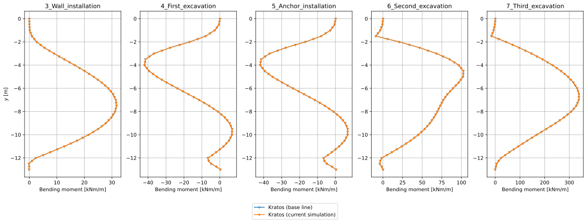
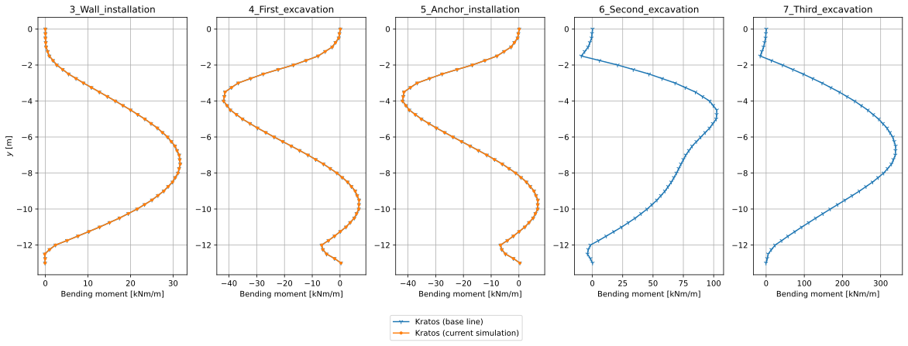

# Getting Started

This section assumes that you are working on a Windows system.

## Preparing your system

To follow along with this tutorial, please make sure that you have a recent Python version (3.11 up to and including 3.14) installed on your system. When you don't have Python installed yet, please download the latest Python installer from the [official Python website](https://www.python.org/) and follow the on-screen instructions to install it.

### Creating a Python venv

It is generally recommended to install the GeoMechanicsApplication in a [Python virtual environment](https://docs.python.org/3/glossary.html#term-virtual-environment) (or "venv", for short). To create such an environment, please carry out the following steps:

- Open a Command Prompt.
- Double-check whether Python is available by executing `python --version`. In this way, you can also verify which Python version you are using.
- Create a folder where you would like to install the GeoMechanicsApplication, e.g. `mkdir GeoMechanicsApplication`.
- Change the current working directory to this new folder: `cd GeoMechanicsApplication`.
- Create a new Python venv: `python -m venv .venv`. Optionally, when you have multiple Python versions installed, you may want to use the [Python launcher](https://docs.python.org/3/using/windows.html#python-launcher-for-windows-deprecated) to indicate which Python version you would like to use. For instance, if you would like to use Python 3.12, execute the following command: `py -3.12 -m venv .venv`.

### Activating the Python venv

The next step is to activate the Python venv by executing the following command: `.venv\Scripts\activate`.

**Note:** When you start a new Command Prompt session where you would like to run GeoMechanicsApplication, you will need to activate this Python venv again, using the above command. There is no need to repeat the steps to create the venv, since it will still be there (unless you have removed it).

## Installing Kratos

You can conveniently install the GeoMechanicsApplication in one of two ways: (1) by using the binaries distributed through [pypi.org](https://pypi.org/), or (2) by installing a set of Python wheels that have been shared with you by the Kratos team at Deltares. In general, you are recommended to use the former. However, there may be cases where you need a more recent or custom build, which would require the latter.

### Using pypi

To install the latest release of GeoMechanicsApplication (currently version 10.4.2) available from [pypi](https://pypi.org/project/KratosGeoMechanicsApplication/), run `pip install KratosGeoMechanicsApplication` in the Command Prompt.

### Using Python wheels

_If you have installed GeoMechanicsApplication [using pypi](#using-pypi), you need to **skip** this section.  In that case, please move on to the [next section](#additional-dependency). For the [DSD-NL 2026](https://softwaredagen.deltares.nl/), please follow the instructions as explained in the previous section. If, however, for some reason that approach doesn't work for you, you can try to download and install the required Python wheels as explained in this section. In that case, the required Python wheels can be downloaded from [SURFfilesender](https://filesender.surf.nl/?s=download&token=41be065a-0b4b-4f37-b193-9fc712932153)._

More recent versions of the main-development branch can be obtained by sending an e-mail to the Kratos team. In that case, please mention which Python version you are using. Once you have received the appropriate `zip` archive, proceed as follows:

- Extract the archive in the `GeoMechanicsApplication` folder that you have created earlier on. This results in a new subdirectory named `wheels`, which contains the `.whl` files.
- Change the current working directory to this new subdirectory: `cd wheels`.
- Install the Python wheels by executing the Windows batch script: `.\install`.

### Additional dependency

The results of the geomechanical analysis that will be run shortly, will be presented to you by means of a set of plots. To generate these plots, we need to install an additional Python package: `pip install matplotlib`.

Note that this additional dependency is required, regardless of how you installed GeoMechanicsApplication (either through pypi or by using a set of Python wheels).

## Running a Kratos simulation

Once Kratos has been installed, we can proceed as follows to run the first geomechanical analysis.

For demonstration purposes, we will analyse the staged construction of a building pit, known as the CROW case. For details about this example, you are referred to the documentation of the corresponding [validation test](https://github.com/KratosMultiphysics/Kratos/blob/master/applications/GeoMechanicsApplication/tests/crow_validation/CROW_documentation.md).

### Downloading the required files

_For your convenience, **during [DSD-NL 2026](https://softwaredagen.deltares.nl/)** you can download a ZIP archive containing the required files related to the CROW case. It is available from [SURFfilesender](https://filesender.surf.nl/?s=download&token=fa2a6e0c-9da1-4b2e-beb7-ed1fa334788d) until June 05, 2026. When you have downloaded this ZIP archive, extract it to the `GeoMechanicsApplication` folder, resulting in a sub-directory named `CROW_case`. It contains the ten files described in the remainder of this section._

First, you will need a set of input files, which consists of a model file (`.mdpa`), an analysis file (`.json`) and two material properties files (`.json`). Create a folder where you will store the input files, e.g. `CROW_case`, and save the following files there:

- [`CROW_case_clay-sand.mdpa`](examples/crow_case/KratosCROW_7Stage_MohrCoulomb/CROW_case_clay-sand.mdpa)
- [`staged_construction.json`](examples/crow_case/KratosCROW_7Stage_MohrCoulomb/staged_construction.json)
- [`initial_materials.json`](examples/crow_case/KratosCROW_7Stage_MohrCoulomb/initial_materials.json)
- [`Mohr_Coulomb_materials.json`](examples/crow_case/KratosCROW_7Stage_MohrCoulomb/Mohr_Coulomb_materials.json)

In addition, to compare the simulation results, we will need the following set of CSV files with base line results:

- [`3_Wall_installation__base_line_wall.csv`](examples/crow_case/KratosCROW_7Stage_MohrCoulomb/3_Wall_installation__base_line_wall.csv)
- [`4_First_excavation__base_line_wall.csv`](examples/crow_case/KratosCROW_7Stage_MohrCoulomb/4_First_excavation__base_line_wall.csv)
- [`5_Anchor_installation__base_line_wall.csv`](examples/crow_case/KratosCROW_7Stage_MohrCoulomb/5_Anchor_installation__base_line_wall.csv)
- [`6_Second_excavation__base_line_wall.csv`](examples/crow_case/KratosCROW_7Stage_MohrCoulomb/6_Second_excavation__base_line_wall.csv)
- [`7_Third_excavation__base_line_wall.csv`](examples/crow_case/KratosCROW_7Stage_MohrCoulomb/7_Third_excavation__base_line_wall.csv)

Finally, we will need a Python script that runs the geomechanical analysis. [The Python script that we have prepared](examples/crow_case/KratosCROW_7Stage_MohrCoulomb/run_simulation.py) also makes plots (SVG files) that show the bending moments, shear forces, normal forces and horizontal total displacements of the sheet pile wall for the various stages. Save this script in the same folder, too.

### Running the base line analysis

To run the simulation from the Command Prompt, first change to the directory where you have saved the downloaded files, e.g. `cd CROW_case`. Then carry out the analysis by executing `python run_simulation.py`. Depending on the available system resources, this may take a minute or more. Running the simulation will produce several output files, including JSON files with analysis results and SVG files with plots.

The following image shows the bending moment distributions for the various stages after a clean and successful run. This image should be identical to what you see when you open the file `bending_moments.svg` on your machine that has been generated by running the Python script.

Note that per stage, two data series are being displayed. The dark blue curve shows the "base line results", i.e. the results corresponding to the set of original input files. The orange curve shows the results of the latest simulation run. Initially, the orange curves overlap the dark blue ones, since the latest simulation run used the base line input. If you now start to modify the input of the simulation (i.e. you start to move away from the base line), you can investigate the effects of your changes.

### Modifying the simulation

After the first successful simulation, you may want to modify some of the input parameters, to see what effect they have on the results. For instance, you may consider to modify any of the following ones (but note that you can try even more variations, if you want to):

- the equivalent thickness of the sheet pile wall;
- the cross-sectional area of the anchor/strut;
- the friction angle of the clay or sand layers;
- the cohesion of the clay or sand layers;
- surface load.

As for any nonlinear finite element analysis, there are no guarantees that it will converge. This is common behaviour when no global equilibrium can be established, e.g. when the sheet pile wall has been underdimensioned. To demonstrate this, consider the case where we reduce the Young's modulus of the anchor's steel by a factor of one million. In that case, the stage with the second excavation does not converge. Consequently, we only get results of the current simulation for the stages up to and including the installation of the anchor, as shown by the following image.

## What you have learned

This page has explained how to prepare your system for the GeoMechanicsApplication and how to install it. It also explained how to run your first simulation, using the CROW case with Mohr-Coulomb material models as an example. Finally, this page suggested a number of changes to the input parameters that you may want to try, to investigate their effects. Now that you have completed this tutorial, you should be able to run similar geotechnical analyses using the GeoMechanicsApplication.
